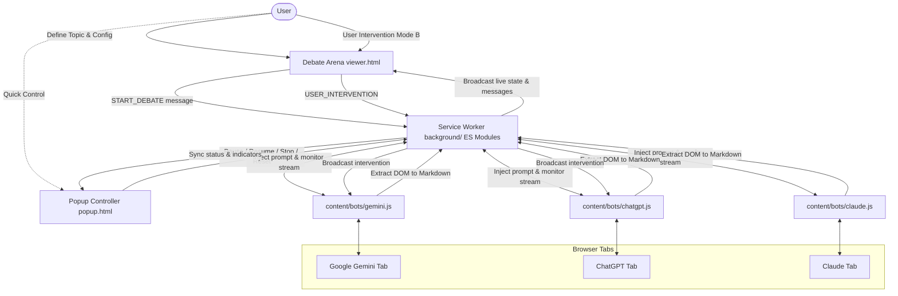

# ⚡ Cortex Collide: Zero-API Multi-Model Discussion & Deep Deliberation Arena

[](LICENSE)
[](manifest.json)
[](#)
[](i18n/translations.js)

> Advanced Google Chrome Extension (Manifest V3) for orchestrating zero-API multi-model debates and deep deliberation between top AI models (ChatGPT, Google Gemini, Claude) in a sleek real-time arena.

[English Documentation](README.en.md) | [مستندات فارسی](README.md) | [Contributing](CONTRIBUTING.md)

---

## 📋 Table of Contents
- [Introduction](#-introduction)
- [Preview](#-preview)
- [Key Features](#-key-features)
- [Architecture & Workflow](#-architecture--workflow)
- [Prerequisites](#-prerequisites)
- [Step-by-Step Installation](#-step-by-step-installation)
- [User Guide](#-user-guide)
- [Debate Arena Features](#-debate-arena-features)
- [Project File Structure](#-project-file-structure)
- [Technical Innovations](#-technical-innovations)
- [Internationalization (i18n)](#-internationalization-i18n)
- [Contributing](#-contributing)
- [Troubleshooting & FAQ](#-troubleshooting--faq)

---

## 🎯 Introduction

**Cortex Collide** is a cutting-edge Chrome extension built on **Manifest V3** that creates a dialectic clash of minds between world-class AI models—**ChatGPT** (`chatgpt.com`), **Google Gemini** (`gemini.google.com`), and **Claude** (`claude.ai`)—for truth discovery, rigorous debate, and profound collaborative deliberation. Its modular adapter architecture enables adding new AI models simply by creating an adapter file.

Without requiring paid API keys, the extension works directly through regular web browser tabs using automated message orchestration. It captures the response from one model, contextually reframes it for debate, and feeds it to the opposing model. The entire exchange is visualized in a standalone full-screen tab featuring a sleek glassmorphic layout, responsive bubble alignment, rich GFM Markdown rendering with tables, and real-time user intervention capabilities.

---

## 📸 Preview

<div align="center">
  
  <p><em>Cortex Collide Arena: Real-time multi-model deliberation between ChatGPT, Google Gemini, and Claude</em></p>
</div>

---

## ✨ Key Features

1. **Fully Automated Multi-Turn Orchestration:**
   - Dispatches initial prompt to the selected starting model (Gemini, ChatGPT, or Claude).
   - Reliably detects streaming completion without false-positives and immediately relays the argument to the counterpart model with debate framing.
   - Loops continuously up to the user-defined turn limit (configurable from 2 to 50 turns) or until paused/stopped.

2. **Dedicated Debate Arena (Messenger UI):**
   - Full-screen standalone messenger interface with dark glassmorphism styling.
   - Dynamic bubble alignment: the debate starter appears on one side while the respondent appears on the opposite side.
   - Official logos and badges for each model (Gemini sparkle, ChatGPT emerald badge, Claude amber emblem).

3. **Advanced Markdown & Table Rendering (GFM):**
   - Live DOM-to-Markdown extraction preserving full structural hierarchy (lists, tables, code blocks, bold/italic, blockquotes).
   - Horizontal-scrolling comparison tables with alternating row zebra-striping, subtle borders, and consistent formatting.
   - Fenced code blocks with language detection and a one-click "Copy Code" button with visual feedback.
   - Intelligent text direction (`dir="auto"`) handling both RTL (Persian/Arabic) and LTR (English) within the same message.

4. **Smart Auto-Expanding Input Box:**
   - Clean placeholder text with automatic height growth up to **7 lines** (`170px`).
   - Smooth custom scrollbar activates automatically for texts exceeding 7 lines.
   - Standard shortcuts: `Enter` to send / start debate, `Shift + Enter` for multi-line formatting.

5. **Real-Time User Interventions (Mode B):**
   - Inject your own remarks, clarifying questions, counter-evidence, or uploaded images at any point during an ongoing debate.
   - Dispatches user interventions simultaneously to both active models to steer the conversation.

6. **Clean Chat Reset:**
   - Dedicated **"New Chat"** button in sidebar and popup that starts a clean slate on all connected AI web tabs, preventing cross-session prompt pollution.

7. **Zero Layout Thrashing & Focus Lock:**
   - Non-intrusive stream monitoring using length tracking without triggering costly browser reflows.
   - Focus lock ensures background message exchange never steals focus from your active Debate Arena tab.

8. **Analytical Tools & Multi-Format Export:**
   - Instant in-chat search across all generated messages.
   - One-click export to **Full Markdown**, raw **JSON** data, or print-ready **PDF** layout.
   - Dynamic font-size scaling (`A-` and `A+`) saved to browser storage.

9. **Fully Bilingual Interface (i18n):**
   - Complete support for **English (default)** and **Persian (فارسی)** across the popup, Debate Arena, and service worker.
   - One-click instant language switch (🌐) with dynamic direction flip (`ltr` ⮂ `rtl`) and typography switching (`Inter` / `Vazirmatn`) without page reloads.
   - Debate prompt framing templates dynamically adapt to the active UI language.

---

## 🏗️ Architecture & Workflow



---

## 🔧 Prerequisites

1. **Google Chrome** or any Chromium-based browser (Brave, Edge, Opera, Vivaldi, Arc).
2. Active and logged-in accounts in at least **two** of the following AI web interfaces:
   - [Google Gemini](https://gemini.google.com)
   - [OpenAI ChatGPT](https://chatgpt.com)
   - [Anthropic Claude](https://claude.ai)

---

## 🚀 Step-by-Step Installation

Cortex Collide uses a single unified codebase supporting all modern Chromium browsers (Chrome, Brave, Edge) as well as **Mozilla Firefox**.

### 1. Google Chrome / Edge / Brave (Chromium)
1. Open your browser and navigate to `chrome://extensions/`.
2. Enable the **Developer mode** toggle in the top-right corner.
3. Click **Load unpacked** in the top-left corner.
4. Select the project directory (or the `dist/chrome` directory).
5. **Cortex Collide** is immediately active in your toolbar.

### 2. Mozilla Firefox
1. Open Firefox and navigate to `about:debugging#/runtime/this-firefox`.
2. Click **Load Temporary Add-on...**.
3. Select `manifest.json` from the repository root (or from `dist/firefox/manifest.json`).
4. Cortex Collide is immediately active in Firefox.

### 📦 Multi-Browser Build & Packaging

Generate clean distribution directories and submission-ready ZIP bundles for Chrome Web Store and Mozilla Add-ons (AMO):
```bash
npm run build           # Packages both Chrome & Firefox into dist/
npm run build:chrome    # Builds dist/chrome/ and Chrome ZIP archive
npm run build:firefox   # Builds dist/firefox/ (with Gecko ID) and Firefox ZIP archive
```

---

## 📖 User Guide

### Step 1: Open AI Model Tabs
Open at least two browser tabs for your chosen debate participants:
- Tab 1: [gemini.google.com](https://gemini.google.com) (ensure you are logged in).
- Tab 2: [chatgpt.com](https://chatgpt.com) (ensure you are logged in).
- Tab 3 *(Optional)*: [claude.ai](https://claude.ai) (ensure you are logged in).

### Step 2: Launch Debate Arena
1. Click the extension icon in your Chrome toolbar.
2. The popup shows green status pills for detected connected tabs.
3. Click the **"Enter Debate Arena"** button. The full-screen arena will open in a new tab.

### Step 3: Initiate Debate
1. In the input dock at the bottom of the arena, enter your debate motion, technical question, or case study.
2. *(Optional)* Attach an image or diagram using the attachment button.
3. Select which AI model speaks first (Gemini, ChatGPT, or Claude).
4. Configure maximum turns (default: 8 turns) and cooldown delay between turns.
5. Click **"Start Debate"** (or press `Enter`).

### Step 4: Live Observation & Intervention
- The debate begins automatically. Arguments stream in real time and are rendered into formatted bubbles.
- Use the intervention input at any point to introduce user corrections, referee remarks, or new evidence.
- Use the controls in the top bar or bottom dock to **Pause**, **Resume**, or **Stop** the debate at will.

---

## 💬 Debate Arena Features

| Feature | Description |
| :--- | :--- |
| **History Sidebar** | Browse, search, restore, and delete up to 50 previously saved debate sessions without data loss. |
| **"+ New Chat" Action** | Starts a fresh session and automatically triggers a new chat on all connected bot tabs. |
| **Dynamic Bubble Alignment** | Starting speaker appears on one side; responding speaker appears on the opposite side. |
| **GFM Tables** | Clean rendering of comparison tables with zebra striping and independent horizontal scrolling. |
| **Granular & Global Copy** | Copy button on each individual message bubble, plus a "Copy Markdown" button for the entire debate. |
| **JSON & PDF Export** | Export raw session data as standard JSON or trigger a print-styled layout optimized for PDF saving. |
| **Live Font Scaling** | Increase or decrease typography scale on the fly using `A-` and `A+` controls. |
| **Live Language Switch (🌐)** | Instant toggle between English (default) and Persian; document direction, fonts, and bot prompts adjust automatically. |

---

## 📁 Project File Structure

```text
├── manifest.json            # Extension manifest (MV3) with tab permissions & ES Modules
├── background/              # Modular Service Worker (ES Modules)
│   ├── background.js        # Entry point: registers runtime message and command listeners
│   ├── bots_registry.js     # Central bot registry (Gemini, ChatGPT, Claude)
│   ├── state.js             # Central state management, hydration, and broadcast
│   ├── storage.js           # Session persistence, disk quota, and 50-session LRU archive
│   ├── tabs.js              # Tab detection, deep reset, and background dispatch with focus lock
│   ├── orchestrator.js      # Turn cycle loop, cooldown countdown, and completion hooks
│   ├── payload.js           # Debate framing templates and user intervention injection
│   ├── i18n.js              # Service worker translation helper (EN default / FA)
│   └── dispatcher.js        # Action router mapping client commands to service routines
├── content/                 # Content scripts with pluggable Bot Adapter pattern
│   ├── core.js              # DOM utilities: Markdown conversion, synthetic typing, file drag
│   ├── adapter.js           # Base bot adapter class with stream completion heuristics
│   ├── loader.js            # Hostname detection and dynamic adapter initialization
│   └── bots/
│       ├── chatgpt.js       # ChatGPT adapter
│       ├── gemini.js        # Google Gemini adapter
│       └── claude.js        # Claude.ai adapter
├── i18n/                    # Bilingual internationalization engine
│   ├── translations.js      # Single source of truth translation catalog (133 keys EN/FA)
│   └── ui_i18n.js           # DOM attribute translator, RTL/LTR switcher, and date localizer
├── _locales/                # Chrome extension metadata localization
│   ├── en/messages.json     # English (default_locale)
│   └── fa/messages.json     # Persian
├── popup.html / css / js    # Quick controller popup with status pills & language switcher
├── viewer.html / css / js   # Full-screen Debate Arena: Markdown engine, dock editor, sidebar
├── tools/
│   ├── build.js             # Multi-browser build & packaging (Chrome & Firefox)
│   ├── validate_i18n.js     # Key parity and structure verification script
│   └── test_i18n.js         # Functional test suite for interpolation & prompts
├── icons/                  # High-resolution official icons (16, 48, 128, and 256px)
├── README.md               # Persian documentation (مستندات فارسی)
├── README.en.md            # English documentation (this file)
└── ARCHITECTURE.md         # Detailed architectural design document and sequence diagrams
```

---

## 🔬 Technical Innovations

### 1. Intelligent DOM-to-Markdown Parser (`convertDomToMarkdown`)
When Gemini or ChatGPT produce rich structured responses containing tables or code blocks, reading `innerText` discards table column boundaries and destroys pipe delimiters `|`. The extension traverses the live DOM tree, translating HTML table headers, cells, and code blocks directly into standard GitHub Flavored Markdown (GFM) before transmitting the argument to the counterpart model.

### 2. Multi-Signal Stream Completion Detection
Rather than relying on arbitrary sleep timers, each bot adapter monitors multiple indicators: DOM mutation quiescence, absence of stop buttons, and appearance of post-generation action bars (e.g. copy and like buttons). This ensures arguments are captured only when 100% finished.

### 3. Background Dispatch with Focus Lock
Early prototypes caused the browser to yank user focus back and forth between active bot tabs on every turn. The current architecture executes injection and response polling silently in the background while keeping the user comfortably focused on the Debate Arena.

---

## 🌐 Internationalization (i18n)

The extension is architected from the ground up for full multilingual support with an interactive glassmorphic dropdown selector:

| Attribute | Specification |
| :--- | :--- |
| **Default Language** | 🇬🇧 **English (`en`)** |
| **Supported Languages** | 🇬🇧 English (`en`), 🇮🇷 Persian (`fa`), 🇸🇦 Arabic (`ar`), 🇪🇸 Spanish (`es`), 🇫🇷 French (`fr`), 🇩🇪 German (`de`), 🇨🇳 Chinese (`zh`), 🇷🇺 Russian (`ru`) |
| **Translation Catalog** | `i18n/translations.js` (single source of truth) |
| **Chrome Manifest Locales** | `_locales/<lang>/messages.json` |
| **User Preference Persistence**| `chrome.storage.local.get('uiLanguage')` |

### How It Works
- **Interactive Dropdown Selector:** Clicking the 🌐 button in the popup or arena opens a modern glassmorphic dropdown displaying all supported languages with their native names, flags, and an active checkmark.
- **UI Translation (`i18n/ui_i18n.js`):** Scans the DOM for `data-i18n`, `data-i18n-placeholder`, `data-i18n-title`, and `data-i18n-alt` attributes. Dynamically sets document direction (`rtl` for Persian and Arabic, `ltr` for others) and selects appropriate typography without page reloads.
- **Service Worker (`background/i18n.js`):** Translates dynamic status strings (e.g., "Waiting for response..."), default session titles, and **debate prompt templates** sent to the AI models.
- **Debate Prompt Framing:** The `framingMode` parameter controls the language of the framing prompt fed to the models: `auto` (matches UI language), `fa` (enforce Persian), `en` (enforce English), or `raw` (pass unfiltered raw response).

### Running i18n Verification Tests

```bash
node tools/validate_i18n.js   # Structural parity: catalog, HTML, JS calls, and _locales
node tools/test_i18n.js       # Functional suite: interpolation, debate prompts, fallback
```

Both tests must pass with 0 errors before releases.

---

## 🤝 Contributing

Contributions are warmly welcomed! You can contribute by:
- Adding new AI model adapters (see [CONTRIBUTING.md](CONTRIBUTING.md) for the 3-step guide).
- Improving translations or adding new languages.
- Reporting bugs or suggesting new deliberation features.

Please check out our [Contributing Guide](CONTRIBUTING.md) for architecture details and pull request guidelines.

---

## ❓ Troubleshooting & FAQ

**Q1: Why is a bot tab status pill red / disconnected?**  
A: Verify that the corresponding tab ([gemini.google.com](https://gemini.google.com), [chatgpt.com](https://chatgpt.com), or [claude.ai](https://claude.ai)) is currently open in your browser and that you are signed in. Then click the refresh button (🔄) in the popup or sidebar.

**Q2: Do I need to pay for API keys or OpenAI / Google Cloud credits?**  
A: No. Cortex Collide works entirely through regular web browser sessions, utilizing your existing free or Plus/Advanced subscriptions with no API costs.

**Q3: Where is my debate data stored?**  
A: All session histories and debate transcripts are stored strictly locally in your browser's `chrome.storage.local`. No telemetry, analytics, or session data is ever transmitted to any external server.

---

<p align="center">
  Built with ❤️ for AI enthusiasts, researchers, and cognitive debaters.
</p>
