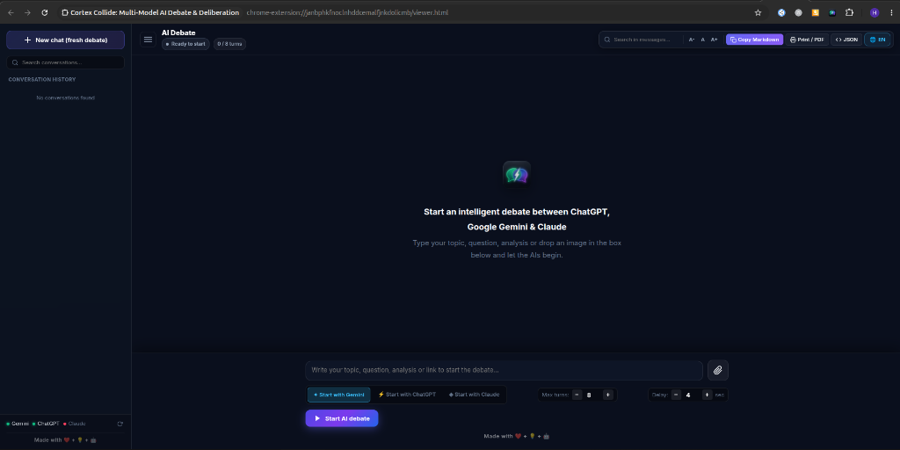
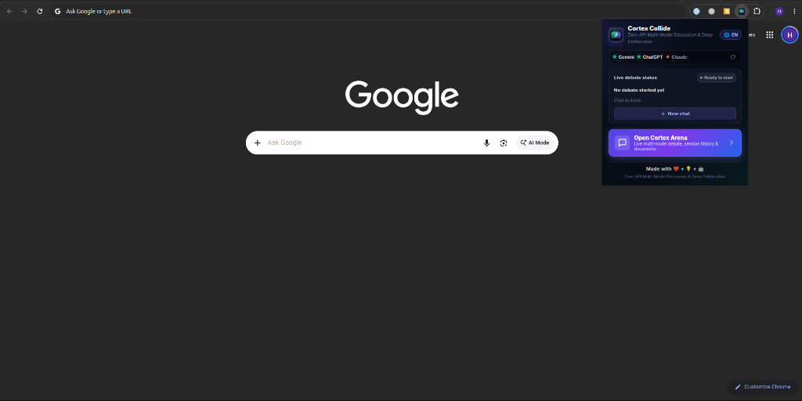
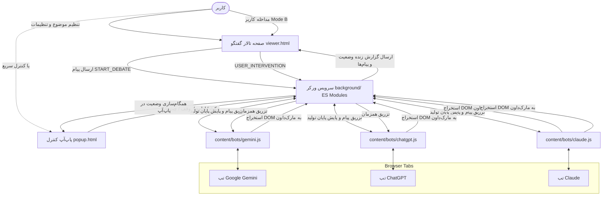

# ⚡ Cortex Collide: تالار مناظره و تقابل فکری مدل‌های هوش مصنوعی (ChatGPT ⮂ Gemini ⮂ Claude)

[](LICENSE)
[](manifest.json)
[](#)
[](i18n/translations.js)

> افزونه پیشرفته گوگل کروم (Manifest V3) برای مباحثه و هم‌اندیشی چندمدلی بدون واسطه (Zero-API)؛ تالار مناظره دیالکتیک و تقابل فکری چت‌بات‌ها برای کشف حقیقت و تحلیل عمیق موضوعات.

[English Documentation](README.md) | [مستندات فارسی](README.fa.md) | [راهنمای مشارکت (Contributing)](CONTRIBUTING.md)

---

## 📋 فهرست مطالب
- [معرفی پروژه](#-معرفی-پروژه)
- [پیش‌نمایش محیط برنامه](#-پیشنمایش-محیط-برنامه)
- [ویژگی‌های شاخص](#-ویژگیهای-شاخص)
- [معماری و نحوه کارکرد](#-معماری-و-نحوه-کارکرد)
- [پیش‌نیازها](#-پیشنیازها)
- [راهنمای نصب گام‌به‌گام](#-راهنمای-نصب-گامبهگام)
- [راهنمای استفاده](#-راهنمای-استفاده)
- [امکانات تالار گفتگو (Debate Arena)](#-امکانات-تالار-گفتگو-debate-arena)
- [ساختار فایل‌های پروژه](#-ساختار-فایلهای-پروژه)
- [جزییات فنی و نوآوری‌ها](#-جزییات-فنی-و-نوآوریها)
- [چندزبانه بودن (i18n)](#-چندزبانه-بودن-i18n)
- [مشارکت و توسعه چت‌بات‌های جدید](#-مشارکت-و-توسعه-چتباتهای-جدید)
- [حمایت مالی (Donation)](#-حمایت-مالی-donation)
- [عیب‌یابی و پرسش‌های متداول](#-عیبیابی-و-پرسشهای-متداول)

---

## 🎯 معرفی پروژه

پروژه **Cortex Collide** یک افزونه مدرن برای مرورگر کروم بر پایه **Manifest V3** است که به کاربر اجازه می‌دهد ذهن‌های مصنوعی برتر جهان یعنی **ChatGPT** (`chatgpt.com`)، **Google Gemini** (`gemini.google.com`) و **Claude** (`claude.ai`) را در یک مباحثه عمیق علمی، فلسفی، فنی یا چالشی رودرروی یکدیگر قرار دهد. معماری پلاگینی افزونه به شما اجازه می‌دهد مدل‌های جدید را فقط با افزودن یک فایل آداپتور اضافه کنید.

افزونه بدون نیاز به کلید API پولی، با باز کردن دو یا سه تب معمولی در مرورگر و از طریق تبادل پیام خودکار، پاسخ یک مدل را خوانده و با زمینه‌سازی هوشمند به مدل دیگر تحویل می‌دهد. تمامی این مکالمات در یک صفحه مستقل با طراحی فوق‌العاده مدرن، تفکیک حباب‌های گفتگو، رندرینگ کامل مارک‌داون و جداول، و پشتیبانی از مداخله لحظه‌ای کاربر نمایش داده می‌شود.

---

## 📸 پیش‌نمایش محیط برنامه

<div align="center">
  
  <br>
  
  <p><em>تالار مناظره زنده و کنترلر پاپ‌آپ Cortex Collide: تقابل فکری و سنتز ایده‌ها بین ChatGPT، Gemini و Claude</em></p>
</div>

---

## ✨ ویژگی‌های شاخص

1. **مدیریت کاملاً خودکار نوبت‌ها (Multi-Turn Orchestration):**
   - ارسال موضوع اولیه به مدل شروع‌کننده (انتخابی: Gemini یا ChatGPT).
   - تشخیص ۱۰۰٪ پایان پاسخ‌دهی و انتقال بلافاصله پاسخ به مدل مقابل با ادبیات متناسب مناظره.
   - تکرار حلقه گفتگو تا سقف نوبت تعیین‌شده (قابل تنظیم از ۲ تا ۵۰ نوبت) یا توقف توسط کاربر.

2. **تالار اختصاصی مناظره (Debate Arena Messenger):**
   - محیط تمام‌صفحه و اختصاصی شبیه پیام‌رسان‌ها با تم تیره شیشه‌ای (Glassmorphism).
   - تفکیک پویای حباب‌های گفتگو به صورت راست و چپ بر اساس اینکه چه کسی بحث را آغاز کرده است.
   - آیکون‌ها و نشان‌های رسمی اختصاصی هر مدل (ستاره رنگین‌کمانی جمنای و گل سرخ‌وش چت‌جی‌پی‌تی).

3. **رندرینگ پیشرفته مارک‌داون و جداول (GFM Markdown):**
   - استخراج پاسخ مدل‌ها با حفظ کامل ساختار DOM و تبدیل به استاندارد GFM Markdown.
   - رندر جداول با قابلیت اسکرول افقی، رنگ‌بندی راه‌راه (Zebra Striping)، حاشیه‌ها و استایل هماهنگ تا جداول مقایسه‌ای طولانی به هیچ وجه به هم نریزند.
   - بلوک‌های کد با برچسب زبان برنامه‌نویسی و دکمه اختصاصی «کپی کد» با بازخورد تصویری («کپی شد!»).
   - رندر خودکار هدینگ‌ها (`H1-H4`)، نقل‌قول‌ها (`blockquote`)، لیست‌ها و متون فارسی و انگلیسی با جهت‌گیری هوشمند (`dir="auto"`).

4. **باکس ورودی هوشمند با رشد خودکار (Auto-Expanding Input):**
   - حذف کامل متون تستی و آماده‌به‌کار با متن راهنما (`placeholder`).
   - بزرگ‌شدن خودکار ارتفاع باکس با نوشتن یا پیست کردن متن تا **۷ خط** (`170px`).
   - فعال‌شدن اسکرول عمودی اختصاصی و ظریف در متون بیش از ۷ خط.
   - پشتیبانی از میانبر `Enter` برای ارسال و `Shift + Enter` برای ایجاد سطر جدید.

5. **قابلیت مداخله کاربر در حین گفتگو (Mode B Interventions):**
   - امکان تزریق نظر، سوال تکمیلی، اصلاحیه، سند یا تصویر توسط کاربر در هر لحظه از بحث.
   - ارسال همزمان پیام مداخله به هر دو هوش مصنوعی برای جهت‌دهی به ادامه مناظره.

6. **ایجاد خودکار چت تمیز و تازه (Clean Chat Reset):**
   - دکمه **«چت تازه»** در سایدبار و پاپ‌آپ که به صورت خودکار در هر دو سایت چت جدید ایجاد می‌کند تا تاریخچه بحث‌ها با گفتگوهای قبلی شما تداخل پیدا نکند.

7. **پایداری بالا و عدم فریز تب‌ها (Zero Layout Thrashing):**
   - پایش هوشمند تولید متن با دسترسی مستقیم به طول حافظه بدون تحمیل پردازش رفلوی مرورگر.
   - قفل تمرکز تب (Focus Lock) تا حین مشاهده گفتگو در صفحه افزونه، فوکوس صفحه کاربر به طور آزاردهنده به تب‌های پشتی نپرد.

8. **ابزارهای تحلیلی و خروجی:**
   - جستجوی بلادرنگ در پیام‌های گفتگو.
   - خروجی با یک کلیک به صورت **Markdown کامل**، فایل داده **JSON** و فرمت چاپ / **PDF**.
   - تغییر اندازه قلم زنده (`A-` و `A+`) با ذخیره‌سازی در حافظه مرورگر.

9. **رابط کاربری کاملاً دو زبانه (Bilingual UI):**
   - پشتیبانی کامل از **انگلیسی (پیش‌فرض)** و **فارسی** در پاپ‌آپ، تالار مناظره و پیام‌های پس‌زمینه.
   - تعویض زنده زبان با یک کلیک (🌐) و تغییر خودکار جهت صفحه (`rtl` / `ltr`) و قلم بدون نیاز به رفرش.
   - ترجمه خودکار متن پرامپت‌های ارسالی به مدل‌ها بر اساس زبان انتخابی کاربر.

---

## 🏗️ معماری و نحوه کارکرد



---

## 🔧 پیش‌نیازها

1. مرورگر **Google Chrome** یا هر مرورگر بر پایه کرومیوم (Brave, Edge, Opera و ...).
2. داشتن حساب کاربری فعال و لاگین‌شده در حداقل **دو** مورد از موارد زیر:
   - [Google Gemini](https://gemini.google.com)
   - [OpenAI ChatGPT](https://chatgpt.com)
   - [Claude](https://claude.ai)

---

## 🚀 راهنمای نصب گام‌به‌گام

پروژه به صورت یکپارچه (Single Codebase) از تمام مرورگرهای مدرن مبتنی بر Chromium (کروم، بریو، اج) و همچنین **موزیلا فایرفاکس** پشتیبانی می‌کند.

### ۱. نصب در گوگل کروم / اج / بریو (Chromium)
1. مرورگر را باز کرده و به آدرس `chrome://extensions/` بروید.
2. از گوشه بالا، گزینه **Developer mode** را فعال کنید.
3. روی دکمه **Load unpacked** کلیک کنید و پوشه پروژه (یا پوشه `dist/chrome`) را انتخاب نمایید.
4. افزونه **Cortex Collide** بلافاصله فعال می‌شود.

### ۲. نصب در موزیلا فایرفاکس (Mozilla Firefox)
1. مرورگر فایرفاکس را باز کرده و به آدرس `about:debugging#/runtime/this-firefox` بروید.
2. روی دکمه **Load Temporary Add-on...** کلیک کنید.
3. فایل `manifest.json` پروژه (یا فایل موجود در `dist/firefox/manifest.json`) را انتخاب نمایید.
4. افزونه فعال شده و آیکون آن در تولبار فایرفاکس پین می‌شود.

### 📦 بیلد و بسته‌بندی برای انتشار استورها

برای ساخت بسته‌های آماده انتشار و فایل‌های ZIP برای استورهای گوگل و موزیلا:
```bash
npm run build           # ساخت بسته‌های کروم و فایرفاکس در پوشه dist/
npm run build:chrome    # ساخت بسته مخصوص کروم (dist/chrome/ و فایل zip)
npm run build:firefox   # ساخت بسته مخصوص فایرفاکس با شناسه Gecko (dist/firefox/ و فایل zip)
```

---

## 📖 راهنمای استفاده

### مرحله ۱: باز کردن تب‌ها
در مرورگر خود حداقل دو تب از سایت‌های زیر باز کنید (هر ترکیبی معتبر است):
- یک تب: [gemini.google.com](https://gemini.google.com) (مطمئن شوید وارد حسابتان شده‌اید).
- یک تب دیگر: [chatgpt.com](https://chatgpt.com) (مطمئن شوید وارد حسابتان شده‌اید).
- (اختیاری) تب سوم: [claude.ai](https://claude.ai) (مطمئن شوید وارد حسابتان شده‌اید).

### مرحله ۲: ورود به تالار مناظره
1. روی آیکون افزونه در نوار ابزار کروم کلیک کنید.
2. چراغ سبز تب‌های متصل (Gemini، ChatGPT و در صورت باز بودن Claude) را در پاپ‌آپ مشاهده خواهید کرد.
3. روی دکمه بزرگ **«ورود به محیط گفتگو»** کلیک کنید تا تالار مناظره در یک تب تمام‌صفحه و زیبا باز شود.

### مرحله ۳: آغاز گفتگو
1. در باکس پایین صفحه، موضوع، سوال، چالش یا شبهه مورد نظرتان را تایپ کنید.
2. در صورت تمایل تصویر یا سندی ضمیمه کنید.
3. مشخص کنید شروع بحث با کدام هوش مصنوعی باشد (Gemini، ChatGPT یا Claude).
4. تعداد سقف نوبت‌ها (پیش‌فرض: ۸ نوبت) و میزان مکث بین نوبت‌ها را مشخص کنید.
5. روی دکمه **«شروع مناظره هوشمند»** (یا زدن کلید `Enter`) کلیک کنید.

### مرحله ۴: مشاهده زنده و مداخله
- بحث آغاز شده و پیام‌ها یکی پس از دیگری در محیط چت ظاهر می‌شوند.
- در هر زمان می‌توانید با باکس مداخله کاربر، نظر یا سوال اصلاحی خود را ارسال کنید تا مستقیماً به هر دو مدل تزریق شود.
- از دکمه‌های کنترل بالا یا پایین می‌توانید بحث را **مکث**، **ادامه** یا به طور کامل **متوقف** کنید.

---

## 💬 امکانات تالار گفتگو (Debate Arena)

| قابلیت | توضیح |
| :--- | :--- |
| **سایدبار سوابق (History)** | امکان مشاهده، جستجو و جابجایی بین گفتگوهای ذخیره‌شده پیشین بدون از دست رفتن داده‌ها. |
| **کلید «+ چت جدید»** | شروع جلسه جدید با ایجاد چت تازه در تمام تب‌های متصل هوش مصنوعی و آماده‌سازی صفحه. |
| **چینش پویا حباب‌ها** | چینش متقارن بر اساس مدل شروع‌کننده (مدل آغازگر در سمت راست، مدل پاسخ‌دهنده در سمت چپ). |
| **جداول استاندارد GFM** | نمایش بدون اشکال انواع جدول‌های مقایسه‌ای همراه با اسکرول مستقل. |
| **کپی تکی و کلی** | دکمه کپی متن هر حباب به صورت مجزا و دکمه «کپی Markdown» برای کل مباحثه در هدر صفحه. |
| **خروجی JSON و PDF** | استخراج فایل استاندارد JSON برای پردازش‌های بعدی یا نسخه آماده چاپ و PDF. |
| **تنظیم فونت زنده** | کوچک و بزرگ کردن اندازه قلم متن‌ها با دکمه‌های `A-` و `A+`. |
| **تغییر زبان زنده (🌐)** | جابجایی آنی میان انگلیسی (پیش‌فرض) و فارسی؛ جهت صفحه، فونت و پرامپت‌های ارسالی به مدل‌ها همگی همگام می‌شوند. |

---

## 📁 ساختار فایل‌های پروژه

```text
├── manifest.json            # مانیفست افزونه (نسخه ۳) با دسترسی به تب‌ها و ES Modules
├── background/              # ماژول‌های Service Worker (ES Modules)
│   ├── background.js        # نقطه ورود سبک: ثبت Listenerهای پیام و کلید میانبر
│   ├── bots_registry.js     # رجیستری مرکزی بات‌ها (Gemini، ChatGPT، Claude)
│   ├── state.js             # مدیریت State، هیدراتاسیون تضمینی و برادکست
│   ├── storage.js           # مدیریت دیسک و آرشیو ۵۰ جلسه اخیر (CRUD)
│   ├── tabs.js              # شناسایی خودکار تب‌ها، ریست عمیق و ارسال با حفظ فوکوس
│   ├── orchestrator.js      # چرخه نوبت‌ها و شمارش معکوس Cooldown سبک
│   ├── payload.js           # قالب‌بندی پیام مناظره و تزریق مدارک جدید کاربر
│   ├── i18n.js              # موتور ترجمه سرویس ورکر (EN پیش‌فرض / FA)
│   └── dispatcher.js        # مسیریاب اکشن‌های ارسالی از کلاینت
├── content/                 # معماری پلاگینی کانتنت اسکریپت‌ها (Adapter Pattern)
│   ├── core.js              # کتابخانه DOM: تبدیل مارک‌داون، شبیه‌سازی تایپ و تصاویر
│   ├── adapter.js           # هسته مرکزی آداپتورها و رصد پایان استریم پاسخ
│   ├── loader.js            # شناسایی خودکار هاست و فعال‌سازی آداپتور مربوطه
│   └── bots/
│       ├── chatgpt.js       # آداپتور اختصاصی ChatGPT
│       ├── gemini.js        # آداپتور اختصاصی Google Gemini
│       └── claude.js        # آداپتور اختصاصی Claude.ai
├── i18n/                    # زیرساخت چندزبانه (EN پیش‌فرض + FA)
│   ├── translations.js      # کاتالوگ کامل ترجمه‌ها (منبع واحد کلیدها)
│   └── ui_i18n.js           # اعمال ترجمه، تنظیم RTL/LTR و مدیریت زبان فعال
├── _locales/                # پیام‌های بومی‌سازی کروم برای نام و توضیح افزونه
│   ├── en/messages.json     # انگلیسی (default_locale)
├── popup/                   # پنجره کنترل سریع و پایش پاپ‌آپ (HTML, CSS, JS)
│   ├── popup.html
│   ├── popup.css
│   └── popup.js
├── viewer/                  # تالار مناظره اصلی و ادیتور پویا (HTML, CSS, JS)
│   ├── viewer.html
│   ├── viewer.css
│   └── viewer.js
├── tools/
│   ├── build.js             # اسکریپت بیلد چندمرورگری کروم و فایرفاکس
│   ├── validate_i18n.js     # اسکریپت اعتبارسنجی تطابق کلیدهای ترجمه
│   └── test_i18n.js         # تست عملکردی موتور ترجمه و پرامپت‌ها
├── icons/                  # پوشه آیکون‌های رسمی برنامه (۱۶، ۴۸، ۱۲۸ و ۲۵۶ پیکسل)
├── README.md               # مستندات انگلیسی پروژه
├── README.fa.md            # راهنمای جامع فارسی (این فایل)
└── ARCHITECTURE.md         # مستندات فنی و دیاگرام‌های عمیق معماری سیستم
```

---

## 🔬 جزییات فنی و نوآوری‌ها

### ۱. تبدیل هوشمند DOM به مارک‌داون (`convertDomToMarkdown`)
هنگامی که جمنای یا چت‌جی‌پی‌تی متنی حاوی جدول یا بلوک کد تولید می‌کنند، در ساختار DOM آنها به المان‌های `<table>` و `<pre>` تبدیل می‌شود. خواندن ساده `innerText` باعث حذف علامت‌های پایپ `|` و به هم ریختگی کامل فرمت در انتقال می‌شد. متد اختصاصی افزونه ساختار زنده DOM را پیمایش کرده و آن را به مارک‌داون کاملاً استاندارد تبدیل می‌کند تا هم مدل مقابل و هم کاربر جدول را تمیز و درست دریافت کنند.

### ۲. اعتبارسنجی دو مرحله‌ای اتمام پاسخ
به جای اتکا به تایمرهای حدسی، افزونه از بررسی تغییرات DOM و ظهور نوار ابزار بازخورد نهایی (دکمه‌های کپی و لایک) استفاده می‌کند؛ به محض ظاهر شدن این نوار ابزار، پاسخ ۱۰۰٪ کامل تشخیص داده شده و ارسال می‌شود.

### ۳. عدم پرش تب کاربر (Focus Lock)
در نسخه‌های پیشین با هر نوبت پاسخ، مرورگر تب فعال کاربر را جابجا می‌کرد. در این نسخه، تا زمانی که کاربر در تب تالار مناظره حضور دارد، ارسال پیام‌ها در پس‌زمینه بدون سوئیچ مزاحم تب‌ها انجام می‌گیرد.

---

## 🌐 چندزبانه بودن (i18n)

افزونه به صورت کامل **چندزبانه** با منوی انتخاب بازشونده (Dropdown) پیاده‌سازی شده است:

| مورد | مقدار |
| :--- | :--- |
| **زبان پیش‌فرض** | 🇬🇧 **English (`en`)** |
| **زبان‌های پشتیبانی‌شده** | 🇬🇧 English (`en`)، 🇮🇷 فارسی (`fa`)، 🇾🇪 العربية (`ar`)، 🇪🇸 Español (`es`)، 🇫🇷 Français (`fr`)، 🇩🇪 Deutsch (`de`)، 🇨🇳 简体中文 (`zh`)، 🇷🇺 Русский (`ru`) |
| **محل کاتالوگ ترجمه** | `i18n/translations.js` (منبع واحد ترجمه‌ها) |
| **پیام‌های بومی‌سازی کروم** | پوشه‌های `_locales/<lang>/messages.json` |
| **ذخیره انتخاب کاربر** | کلید `uiLanguage` در `chrome.storage.local` |

### چطور کار می‌کند؟
- **منوی انتخاب بازشونده (Dropdown):** با کلیک روی آیکون 🌐 در پاپ‌آپ یا تالار مناظره، منویی شیشه‌ای باز می‌شود که زبان‌های مختلف را همراه با نام بومی و پرچم نمایش می‌دهد و زبان جاری را با تیک مشخص می‌کند.
- **رابط کاربری (Popup و Arena):** ماژول `i18n/ui_i18n.js` همه عناصر دارای صفت‌های `data-i18n`، `data-i18n-placeholder`، `data-i18n-title` و `data-i18n-alt` را ترجمه کرده و به صورت خودکار جهت صفحه را تنظیم می‌کند (`fa` و `ar` → `rtl`، سایر زبان‌ها → `ltr`). تاریخ‌ها نیز با `locale` مناسب قالب‌بندی می‌شوند.
- **سرویس ورکر:** ماژول `background/i18n.js` تمام پیام‌های وضعیت (مثل «در انتظار پاسخ...»)، عنوان سشن‌ها و **متن پرامپت‌های ارسالی به چت‌بات‌ها** را ترجمه می‌کند.
- **تغییر زبان زنده:** با دکمه 🌐 در پاپ‌آپ یا هدر تالار مناظره، زبان بلافاصله بدون بستن صفحه عوض می‌شود. زبان جدید از طریق اکشن `SET_LANGUAGE` به سرویس ورکر اطلاع داده می‌شود تا پیام‌های بعدی هم با همان زبان تولید شوند.
- **زبان پرامپت مناظره:** فیلد `framingMode` تعیین می‌کند متن گفتگو که به مدل‌ها تحویل داده می‌شود به چه زبانی باشد: `auto` (پیروی از زبان رابط)، `fa` (اجبار فارسی)، `en` (اجبار انگلیسی) یا `raw` (بدون قاب‌بندی و ارسال متن خام).

### افزودن یک زبان جدید
1. یک بلاک جدید (مثلاً `de: { ... }`) در `i18n/translations.js` کنار `en` و `fa` اضافه کنید و همه کلیدها را ترجمه کنید.
2. پوشه `_locales/de/messages.json` را با همان کلیدهای `en` بسازید (نام، توضیح، عنوان و متن میانبر).
3. در پاپ‌آپ و تالار، دکمه زبان را به حالت چندگزینه‌ای گسترش دهید (تابع `refreshLangToggle` در `popup.js` و `viewer.js`).
4. برای اعتبارسنجی خودکار، اسکریپت بررسی تطابق کلیدها را اجرا کنید: تمام کلیدهای `en` و `fa` باید یکسان باشند تا هیچ متن ترجمه‌نشده‌ای در صفحه ظاهر نشود.

### ابزارهای اعتبارسنجی

```bash
node tools/validate_i18n.js   # تطابق کلیدها میان کاتالوگ، HTML، JS و _locales
node tools/test_i18n.js       # تست عملکردی: درون‌یابی متغیرها، پرامپت مناظره، fallback
```

اسکریپت اول ساختار را بررسی می‌کند (کلیدهای گمشده، متن فارسی جامانده در HTML، پیام‌های ناهماهنگ `_locales`) و اسکریپت دوم رفتار واقعی موتور ترجمه را می‌سنجد (بدون placeholder ترجمه‌نشده، تفاوت واقعی EN و FA، بازگشت امن به انگلیسی برای زبان ناشناس).

---

## 🤝 مشارکت و توسعه چت‌بات‌های جدید

مشارکت در توسعه **Cortex Collide** بسیار ارزشمند است و با آغوش باز پذیرفته می‌شود! شما می‌توانید از راه‌های زیر به پروژه کمک کنید:
- **افزودن آداپتورهای جدید هوش مصنوعی** (مانند DeepSeek، Grok، Mistral، Perplexity یا مدل‌های دیگر) در ۳ گام ساده (توضیحات کامل در [CONTRIBUTING.md](CONTRIBUTING.md)).
- **تکمیل یا بهبود ترجمه‌ها** به زبان‌های دیگر در `i18n/translations.js`.
- **گزارش باگ‌ها، ارائه ایده‌ها و بهبود تجربه کاربری تالار مناظره**.

برای مشاهده جزئیات معماری و راهنمای ساخت Pull Request، لطفاً [راهنمای مشارکت (CONTRIBUTING.md)](CONTRIBUTING.md) را مطالعه نمایید.

---

## ☕ حمایت مالی (Donation)

افزونه Cortex Collide کاملاً رایگان و متن‌باز است. متأسفانه به دلیل عدم دسترسی به درگاه‌های پرداخت بین‌المللی، امکان پرداخت مستقیم هزینه ثبت‌نام اکانت توسعه‌دهنده در فروشگاه گوگل کروم (Chrome Web Store) در حال حاضر فراهم نیست.

**حمایت‌های مالی شما مستقیماً برای تأمین هزینه ثبت اکانت در گوگل کروم استفاده خواهد شد تا بتوانیم این افزونه را به‌طور رسمی در استور گوگل کروم نیز برای همه منتشر کنیم.**

<p align="center">
  <a href="https://coindrop.to/yasilo" target="_blank">
    
  </a>
  <br><br>
  
  <br>
  <span style="font-size: 12px; color: #888;">اسکن کد QR با گوشی جهت پرداخت سریع</span>
</p>

---

## ❓ عیب‌یابی و پرسش‌های متداول

**سؤال ۱: چرا چراغ اتصال تب‌ها قرمز است؟**  
پاسخ: مطمئن شوید تب‌های موردنیاز یعنی [gemini.google.com](https://gemini.google.com) و [chatgpt.com](https://chatgpt.com) (و در صورت استفاده [claude.ai](https://claude.ai)) در مرورگر باز بوده و لاگین هستید. سپس در پاپ‌آپ یا تالار روی دکمه بررسی مجدد تب‌ها (🔄) کلیک کنید.

**سؤال ۲: آیا این افزونه نیاز به پرداخت هزینه یا کلید API دارد؟**  
پاسخ: خیر، کاملاً رایگان است و Cortex Collide مستقیماً با حساب‌های کاربری فعال شما در وب‌سایت‌ها (رایگان یا پیشرفته) کار می‌کند و هیچ هزینه‌ای بابت کلیدهای API متحمل نخواهید شد.

**سؤال ۳: آیا داده‌های گفتگوهای من ذخیره می‌شوند؟**  
پاسخ: تمام سوابق و پیام‌ها به طور امن و صرفاً داخل مرورگر خود شما (`chrome.storage.local`) ذخیره می‌شوند و به هیچ سرور واسطی ارسال نمی‌گردند.

---

<p align="center">
  ساخته‌شده با ❤️ برای علاقه‌مندان به هوش مصنوعی و مناظره‌های شناختی
</p>
